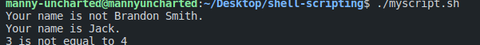

# Shell Scripting


## The Shell
The shell is the operating system's command-line interface (CLI) and interpreter for the set of commands that are used to communicate with the system.

## Shell Script
A shell script is usually created for command sequences in which a user has a need to use repeatedly in order to save time.

## Shell commands
- We create a script using the command.
```
touch myscript.sh
```
and make it executable using the command
```
chmod +x myscript.sh
```
and to run it
```
./myscript.sh
```

To check the location of the bash command 
```
which bash
```


### ECHO COMMAND
The echo command is used to print text to the screen.

```
echo "Hello World"
```


### Working with Variables
Variables are named identifiers that store values. It is uppercase by convention. Accepts letters, numbers, and underscores as variable names.

In this example we'll be declaring a variable.
```
NAME="Brandon"
```
and output it using the echo command and the $ sign or the ${variable-name} .
```
echo "My name is $NAME"
or
echo "My name is ${NAME}"
```


### Taking input from the user
The read command is used to take input from the user.

```
read -p "What is your name? " NAME
```
and then to output the user input using the echo command.
```
echo "Hello $NAME"
```


### Working with conditionals
Like every programming language, conditionals help to evaluate whether an action should be performed or not.
#### The IF statement
The if statement is used to evaluate a condition.

```
if [condition]
then
    command
fi
```
example:
```
$NAME="Brandon Smith"
if [ "$NAME" == "Brandon Smith" ]
then
    echo "Your name is Brandon Smith"
fi
```


#### The ELIF and ELSE Statement
The work about the same as the if statement, except that it is used to evaluate multiple conditions.

```
if [condition]
then
    command
elif [condition]
then
    command
fi
```
example:
```
if [ "$NAME" == "Brandon Smith" ]
then
    echo "Your name is Brandon Smith."
elif [ "$NAME" == "Jack" ]
then
    echo "Your name is Jack."
else
    echo "Your name is not Brandon Smith."
fi
```


### LOGICAL OPERATORS
Logical operators are used to evaluate multiple conditions.
Below are the key values for the logical operators.

```
"-eq" : val1 -eq val2 Returns true if the values are equal.
"-ne" : val1 -ne val2 Returns true if the values are not equal.
"-gt" : val1 -gt val2 Returns true if val1 is greater than val2.
"-gt" : val1 -ge val2 Returns true if val1 is greater than or equal to val2.
"-lt" : val1 -lt val2 Returns true if val1 is less than val2.
"-le" : val1 -le val2 Returns true if val1 is less than or equal to val2.
```
example:
using the "-eq" operator
```
$NUM1=3
$NUM2=4

if [ $NUM1 -eq $NUM2 ]
then
    echo "$NUM1 is equal to $NUM2"
else
    echo "$NUM1 is not equal to $NUM2"
fi
```


### FILE CONDITIONS
The following are the key values for the file conditions.

```
"-b": -b file Returns true if the file exists and is a block device.
"-d": -d file Returns true if the file exists and is a directory.
"-e": -e file Returns true if the file exists.
"-f": -f file Returns true if the file exists and is a regular file.
"-g": -g file Returns true if the group id is set on the file.
"-r": -r file Returns true if the file exists and is readable.
```
example:
```
touch myfile.txt
FILE="myfile.txt"
if [ -f "$FILE" ]
then
    echo "The file $FILE exists and is a file."
else
    echo "The file $FILE does not exist."
fi
```


### CASE STATEMENT
The case statement is used to evaluate a condition.

```
case expression in
    pattern1 )
        command1
        command2
        ;;
    pattern2 )
        command3
        command4
        ;;
    * )
        command5
        command6
        ;;
esac
```
example:
```
read -p "Are you 21 or older? Y/N" ANSWER
case "$ANSWER" in
    [yY] | [yY][eE][sS])
        echo "You can drink!"
        ;;
    [nN] | [nN][oO])
        echo "You can not drink!"
        ;;
    *)
        echo "Please enter y/yes or n/no"
        ;;
esac
```
